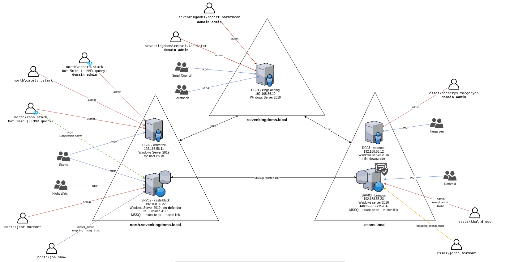

https://github.com/Orange-Cyberdefense/GOAD/blob/main/docs/img/GOAD_schema.png

As I earned my Practical Network Penetration Tester (PNPT) certification from TCM Security, I wanted to further advance and improve my knowledge. My new goal became the OSCP certification. As I engaged with industry professionals across my country, I learned that this certification had become the standard. As I love new challenges I started to dig deep into what resources should I utilize and where should I begin.

Although I started the CPTS learning path at HTB Academy I needed an additional home lab where I could practice everything I learned and is going to hold a stronghold for all my attacks and strategies. I decided to set up the Game of Active Directory (GOAD) as it is going to be just an awesome playground to practice my skills.

The author of this lab is Mayfly who was kind enough to make this lab publicly accessible and provide amazing documentation as I set up the lab. (I am going to link Mayfly's documentation at the end of the resources section)
There are many ways to set up this home lab and I even found an amazing video from Conda that showcased how an individual can easily deploy this. (I am going to link the video to the resources section)

The bare minimum hardware requirements for the version I was setting up were 24GB of RAM and 120GB of storage.

**Before I begin I would like to express that so many write-ups are edited in a way that everything works just right out of the box. But I believe that there are just other things behind the curtain that do not get enough attention. I had to troubleshoot a lot of things to meet the requirements to build the lab and I just learned so much during that process that's why I am going to include it in my write-up, because it also helped me improve.**

I am going to split my write-up into two sections, one of them is going to focus on how I troubleshoot my problems along the way as I know it can be beneficial for later. The other section is going to focus on the commands and steps I did to set up the home lab.

---

The problems I faced during the setup (as I followed the steps during the setup video):


As the lab is intended to be installed from a Linux host and was tested only on this for the documentation. The wise step was to use nested virtualization this way the lab can be set up within a VM. 

As I use VMware nested virtualization was not of an easy step because I needed to reproduce the following steps to make it work.

.png)
Had to turn these off.

Also had to turn off memory integrity. 

.png)


After these steps, I was able to start my VMware host Linux machine with the following setting, which enabled nested virtualization:

.png)

---

I set up a dedicated VM for this task and decided to use a separate installer image. With a new set, I installed VirtualBox with the following command.

```bash
sudo apt install virtualbox -y
```
But this was not enough, on a newly installed .iso image you need to install the kernel modules.

You can check the status with the following command:

```bash
sudo service virtualbox status
```

You can check the kernel modules with the following command:

```bash
uname -r
```

And after this command, I needed to download the right ones:

```bash
sudo apt install linux-headers |kernelmodules|
```

A possible workaround would be to install a pre-built virtual machine and after installing VirtualBox it is going to work right out of the box.

.png)

Also, I ran into the problem that I did not have enough storage dedicated to the VM and I found a tool named GParted to be most efficient to resolve this issue.

.png)

.png)


---
After resolving all my upcoming issues I used to follow a chain of steps to set up the lab:

```bash
sudo apt install virtualbox -y
```

```bash
sudo apt install vagrant
```

I also went with the docker installation method as it seemed like the fastest and easiest.

```bash
sudo apt install docker.io -y
```

```bash
vagrant plugin install vagrant-reload
```

```bash
gem install winrm winrm-fs winrm-elevated
```

After installing all these requirements I installed the GitHub directory related to the project.

```bash
git clone https://github.com/Orange-Cyberdefense/GOAD.git
```

I changed my directory to GOAD and ran a check script to make sure I was ready to go and install.

```bash
./goad.sh -t check -l GOAD -p virtualbox -m docker
```

After a successful affirmation, I can run the install script as well.

```bash
./goad.sh -t install -l GOAD -p virtualbox  -m docker
```

This was going to run for a few hours but after that, I was good to go. It is important to note that the labs can be started with the following command:

```bash
./goad.sh -t start -p virtualbox -l GOAD -m docker
```


---
**Resources:**

Video I used for the setup:

- https://www.youtube.com/watch?v=fXausmYcObE

The GitHub page I also used along my setup:

- https://github.com/Orange-Cyberdefense/GOAD

The specific documentation I used:

- https://github.com/Orange-Cyberdefense/GOAD/blob/main/docs/install_with_virtualbox.md

**If you notice mistakes or typos or you just have suggestions I would love to hear your feedback and improve at the same time.**


