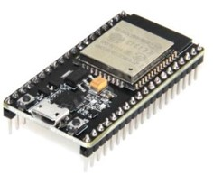
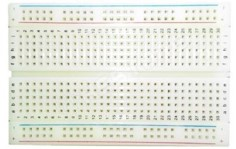
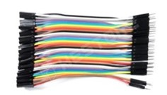
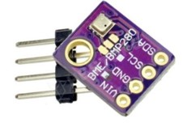
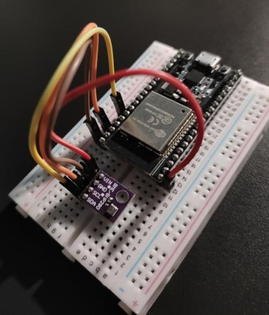

The reason why I published this project is because later this year I want to learn IoT hacking and showcase that I became interested in this section of IT Security by creating an actual IoT device.

Building an IoT thermometer was an exciting thing to do even if I knew nothing about how to build the board or write the code for it. 

Of course, this is a simpler circuit. If this device had been used more often I would have built a distributed network (e.g., MQTT) instead of the rudimentary HTML handling.

---
## Introduction

I'm going to show how I built a home weather station, which, thanks to the sensor used, not only displays the current temperature or humidity value, but thanks to the integrated pressure gauge, it can actually predict what the weather will be in the coming days.

---
## Hardware Assembly

The precision sensor of Bosch is excellent and at the same time cheap detection solution with humidity accuracy of +-3, barometric pressure with absolute accuracy of +-1 hPa and temperature accuracy of 1.0 C

Since the atmospheric pressure is proportional to the altitude, the accuracy mentioned allows us to measure it with the sensor to an accuracy of up to 1 meter!

The BME280 is an evolution of the previous BMP085 BMP180 BMP183 sensor family from bosch, with a lower noise but equally fast conversion time. For the easy cable management, I only needed four wires to choose i2c communication


---
## Hardware components needed for implementation

* NodeMCU-ESP-32S 
* Breadboard and connection cables
* USB cable for programming ESP-32
* BME280-M 






---
## Wiring the BME280 sensor

The sensor can be connected to the ESP-32 using either the SPI or I2C bus (I chose I2C). The SPI bus requires four data lines and two power lines, whereas the I2C bus only requires two data lines and two power lines. For power supply, I could use either 5V or 3.3V, as the voltage regulator on the sensor board allows the appropriate voltage value to be set.

---
## Preferred method for wiring the BME280 sensor

If I use the I2C bus for communication, the sensor can have two possible addresses. The default value is 0x77. The address is determined by the voltage connected to the SDO pin. The pull-up resistor on the board pulls the SDO pin to a high logical level, setting the address to 0x77. This is the default address for the board. The other option is to connect the SDO to ground (GND), which sets the logical level to low and changes the address to 0x76.

.jpg)
.jpg)

When using the I2C bus, only the following connections are required:

.jpg)

---
## Sample programs

To run the sample programs, I needed a library that supports reading data from the sensor. In my project, I used the Adafruit Unified Sensor library and the BME280 library, which reads the sensor's current data using the following handle_OnConnect() command and then processes the pressure, temperature, and humidity values with the appropriate functions.

.jpg)

.png)

A key feature of the library is the calibration and the so-called offset setting. Test measurements showed that the sensor mounted on the board detects the heat from the voltage stabilizers, resulting in a constant "offset" in the measured values. The setTempCal() function allows for the correction of the measured values; for example, the command setTempCal(-2) reduces the displayed value by two degrees, thus providing accurate results. The default calibration offset is 0, so this function should only be used when a calibration value different from 0 needs to be applied.

---
## Reading data

Reading the temperature, humidity, pressure, and estimated altitude is as simple as using the following functions on the bme object:

- **`bme.readTemperature()`** — Displays the temperature in Celsius.  
- **`bme.readHumidity()`** — Displays the humidity.  
- **`bme.readPressure()`** — Reads the pressure at sea level.  
- **`bme.readAltitude(SEALEVELPRESSURE_HPA)`** — Estimates the altitude based on the sea level pressure.  

.jpg)

---
## Program operation

The code begins by including the necessary libraries: the Wire library for I2C communication, as well as the Adafruit_Sensor and Adafruit_BME280 libraries for interfacing with the BME280 sensor. The Webserver and WiFi libraries enable the display of the measured parameters on a web page.

.jpg)

After assembly, the device looked like this:



```cpp
#include <WiFi.h>
#include <WebServer.h>
#include <Wire.h>
#include <Adafruit_Sensor.h>
#include <Adafruit_BME280.h>
 
#define SEALEVELPRESSURE_HPA (1013.25)
 
Adafruit_BME280 bme;
 
float temperature, humidity, pressure, altitude;
 

const char* ssid = "AWT";  
const char* password = "science.almafa";  
 
WebServer server(80);             
 
void setup() {
  Serial.begin(115200);
  delay(100);
  
  bme.begin(0x76);   
 
  Serial.println("Connecting to ");
  Serial.println(ssid);
 
  
  WiFi.begin(ssid, password);
 
  
  while (WiFi.status() != WL_CONNECTED) {
  delay(1000);
  Serial.print(".");
  }
  Serial.println("");
  Serial.println("WiFi connected..!");
  Serial.print("Got IP: ");  Serial.println(WiFi.localIP());
 
  server.on("/", handle_OnConnect);
  server.onNotFound(handle_NotFound);
 
  server.begin();
  Serial.println("HTTP server started");
 
}
void loop() {
  server.handleClient();
}
 
void handle_OnConnect() {
  temperature = bme.readTemperature();
  humidity = bme.readHumidity();
  pressure = bme.readPressure() / 100.0F;
  altitude = bme.readAltitude(SEALEVELPRESSURE_HPA);
  server.send(200, "text/html", SendHTML(temperature,humidity,pressure,altitude)); 
}
 
void handle_NotFound(){
  server.send(404, "text/plain", "Not found");
}
 
String SendHTML(float temperature,float humidity,float pressure,float altitude){
  String ptr = "<!DOCTYPE html>";
  ptr +="<html>";
  ptr +="<head>";
  ptr +="<title>ESP32 Weather Station</title>";
  ptr +="<meta name='viewport' content='width=device-width, initial-scale=1.0'>";
  ptr +="<link href='https://fonts.googleapis.com/css?family=Open+Sans:300,400,600' rel='stylesheet'>";
  ptr +="<style>";
  ptr +="html { font-family: 'Open Sans', sans-serif; display: block; margin: 0px auto; text-align: center;color: #444444;}";
  ptr += "body { margin: 0px; background-color: grey; } ";
  ptr +="h1 {margin: 50px auto 30px;} ";
  ptr +=".side-by-side{display: table-cell;vertical-align: middle;position: relative;}";
  ptr +=".text{font-weight: 600;font-size: 19px;width: 200px;}";
  ptr +=".reading{font-weight: 300;font-size: 50px;padding-right: 25px;}";
  ptr +=".temperature .reading{color: #F29C1F;}";
  ptr +=".humidity .reading{color: #3B97D3;}";
  ptr +=".pressure .reading{color: #26B99A;}";
  ptr +=".altitude .reading{color: #955BA5;}";
  ptr +=".superscript{font-size: 17px;font-weight: 600;position: absolute;top: 10px;}";
  ptr +=".data{padding: 10px;}";
  ptr +=".container{display: table;margin: 0 auto;}";
  ptr +=".icon{width:65px}";
  ptr +="</style>";
  ptr +="</head>";
  ptr +="<body>";
  ptr +="<h1>ESP32 Weather Station</h1>";
  ptr +="<div class='container'>";
  ptr +="<div class='data temperature'>";
  ptr +="<div class='side-by-side icon'>";
  ptr +="<svg enable-background='new 0 0 19.438 54.003'height=54.003px id=Layer_1 version=1.1 viewBox='0 0 19.438 54.003'width=19.438px x=0px xml:space=preserve xmlns=http://www.w3.org/2000/svg xmlns:xlink=http://www.w3.org/1999/xlink y=0px><g><path d='M11.976,8.82v-2h4.084V6.063C16.06,2.715,13.345,0,9.996,0H9.313C5.965,0,3.252,2.715,3.252,6.063v30.982";
  ptr +="C1.261,38.825,0,41.403,0,44.286c0,5.367,4.351,9.718,9.719,9.718c5.368,0,9.719-4.351,9.719-9.718";
  ptr +="c0-2.943-1.312-5.574-3.378-7.355V18.436h-3.914v-2h3.914v-2.808h-4.084v-2h4.084V8.82H11.976z M15.302,44.833";
  ptr +="c0,3.083-2.5,5.583-5.583,5.583s-5.583-2.5-5.583-5.583c0-2.279,1.368-4.236,3.326-5.104V24.257C7.462,23.01,8.472,22,9.719,22";
  ptr +="s2.257,1.01,2.257,2.257V39.73C13.934,40.597,15.302,42.554,15.302,44.833z'fill=#F29C21 /></g></svg>";
  ptr +="</div>";
  ptr +="<div class='side-by-side text'>Temperature</div>";
  ptr +="<div class='side-by-side reading'>";
  ptr +=(int)temperature;
  ptr +="<span class='superscript'>&deg;C</span></div>";
  ptr +="</div>";
  ptr +="<div class='data humidity'>";
  ptr +="<div class='side-by-side icon'>";
  ptr +="<svg enable-background='new 0 0 29.235 40.64'height=40.64px id=Layer_1 version=1.1 viewBox='0 0 29.235 40.64'width=29.235px x=0px xml:space=preserve xmlns=http://www.w3.org/2000/svg xmlns:xlink=http://www.w3.org/1999/xlink y=0px><path d='M14.618,0C14.618,0,0,17.95,0,26.022C0,34.096,6.544,40.64,14.618,40.64s14.617-6.544,14.617-14.617";
  ptr +="C29.235,17.95,14.618,0,14.618,0z M13.667,37.135c-5.604,0-10.162-4.56-10.162-10.162c0-0.787,0.638-1.426,1.426-1.426";
  ptr +="c0.787,0,1.425,0.639,1.425,1.426c0,4.031,3.28,7.312,7.311,7.312c0.787,0,1.425,0.638,1.425,1.425";
  ptr +="C15.093,36.497,14.455,37.135,13.667,37.135z'fill=#3C97D3 /></svg>";
  ptr +="</div>";
  ptr +="<div class='side-by-side text'>Humidity</div>";
  ptr +="<div class='side-by-side reading'>";
  ptr +=(int)humidity;
  ptr +="<span class='superscript'>%</span></div>";
  ptr +="</div>";
  ptr +="<div class='data pressure'>";
  ptr +="<div class='side-by-side icon'>";
  ptr +="<svg enable-background='new 0 0 40.542 40.541'height=40.541px id=Layer_1 version=1.1 viewBox='0 0 40.542 40.541'width=40.542px x=0px xml:space=preserve xmlns=http://www.w3.org/2000/svg xmlns:xlink=http://www.w3.org/1999/xlink y=0px><g><path d='M34.313,20.271c0-0.552,0.447-1,1-1h5.178c-0.236-4.841-2.163-9.228-5.214-12.593l-3.425,3.424";
  ptr +="c-0.195,0.195-0.451,0.293-0.707,0.293s-0.512-0.098-0.707-0.293c-0.391-0.391-0.391-1.023,0-1.414l3.425-3.424";
  ptr +="c-3.375-3.059-7.776-4.987-12.634-5.215c0.015,0.067,0.041,0.13,0.041,0.202v4.687c0,0.552-0.447,1-1,1s-1-0.448-1-1V0.25";
  ptr +="c0-0.071,0.026-0.134,0.041-0.202C14.39,0.279,9.936,2.256,6.544,5.385l3.576,3.577c0.391,0.391,0.391,1.024,0,1.414";
  ptr +="c-0.195,0.195-0.451,0.293-0.707,0.293s-0.512-0.098-0.707-0.293L5.142,6.812c-2.98,3.348-4.858,7.682-5.092,12.459h4.804";
  ptr +="c0.552,0,1,0.448,1,1s-0.448,1-1,1H0.05c0.525,10.728,9.362,19.271,20.22,19.271c10.857,0,19.696-8.543,20.22-19.271h-5.178";
  ptr +="C34.76,21.271,34.313,20.823,34.313,20.271z M23.084,22.037c-0.559,1.561-2.274,2.372-3.833,1.814";
  ptr +="c-1.561-0.557-2.373-2.272-1.815-3.833c0.372-1.041,1.263-1.737,2.277-1.928L25.2,7.202L22.497,19.05";
  ptr +="C23.196,19.843,23.464,20.973,23.084,22.037z'fill=#26B999 /></g></svg>";
  ptr +="</div>";
  ptr +="<div class='side-by-side text'>Pressure</div>";
  ptr +="<div class='side-by-side reading'>";
  ptr +=(int)pressure;
  ptr +="<span class='superscript'>hPa</span></div>";
  ptr +="</div>";
  ptr +="<div class='data altitude'>";
  ptr +="<div class='side-by-side icon'>";
  ptr +="<svg enable-background='new 0 0 58.422 40.639'height=40.639px id=Layer_1 version=1.1 viewBox='0 0 58.422 40.639'width=58.422px x=0px xml:space=preserve xmlns=http://www.w3.org/2000/svg xmlns:xlink=http://www.w3.org/1999/xlink y=0px><g><path d='M58.203,37.754l0.007-0.004L42.09,9.935l-0.001,0.001c-0.356-0.543-0.969-0.902-1.667-0.902";
  ptr +="c-0.655,0-1.231,0.32-1.595,0.808l-0.011-0.007l-0.039,0.067c-0.021,0.03-0.035,0.063-0.054,0.094L22.78,37.692l0.008,0.004";
  ptr +="c-0.149,0.28-0.242,0.594-0.242,0.934c0,1.102,0.894,1.995,1.994,1.995v0.015h31.888c1.101,0,1.994-0.893,1.994-1.994";
  ptr +="C58.422,38.323,58.339,38.024,58.203,37.754z'fill=#955BA5 /><path d='M19.704,38.674l-0.013-0.004l13.544-23.522L25.13,1.156l-0.002,0.001C24.671,0.459,23.885,0,22.985,0";
  ptr +="c-0.84,0-1.582,0.41-2.051,1.038l-0.016-0.01L20.87,1.114c-0.025,0.039-0.046,0.082-0.068,0.124L0.299,36.851l0.013,0.004";
  ptr +="C0.117,37.215,0,37.62,0,38.059c0,1.412,1.147,2.565,2.565,2.565v0.015h16.989c-0.091-0.256-0.149-0.526-0.149-0.813";
  ptr +="C19.405,39.407,19.518,39.019,19.704,38.674z'fill=#955BA5 /></g></svg>";
  ptr +="</div>";
  ptr +="<div class='side-by-side text'>Altitude</div>";
  ptr +="<div class='side-by-side reading'>";
  ptr +=(int)altitude;
  ptr +="<span class='superscript'>m</span></div>";
  ptr +="</div>";
  ptr +="</div>";
  ptr +="</body>";
  ptr +="</html>";
  return ptr;
}
```

---

References used:


* https://www.waveshare.com/w/upload/7/75/BME280_Environmental_Sensor_User_Manual _EN.pdf
* https://www.edu.xunta.gal/centros/ieslaxeiro/system/files/BME280%20Sensor%20Module_ EN.pdf
* https://randomnerdtutorials.com/esp32-web-server-with-bme280-mini-weather-station/
* https://randomnerdtutorials.com/esp32-bme280-arduino-ide-pressure-temperature-humidity/
* https://how2electronics.com/esp32-bme280-mini-weather-station/
* https://www.malnasuli.hu/projektek/epitsunk-meteorologiai-allomast-bme280/
